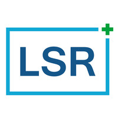

# ProjectCPP
Owned by: Life Science Robotics & Aalborg University




SAS Project Devices project using CPP language.
This repository contains the following directories:

* HMI: GUI for the SAS application.
* SASApp: Sense-and-Stimulation C++ application.
* Matlab_scripts: contains all .m scripts and functions for processing data and filter testing.
* Complementary programmes: extra C++ apps with emulators and offline C-filtering.


### Requirements ###

For the C++ applications:
* Visual Studio version 2019 or later.
* Specific for SASApp: installed COM drivers from Hasomed. Available in the SAS Dropbox shared folder.


For testing and analysis:
* Matlab version 2019b or later.
* Matlab Digital Signal Processing (DSP) toolbox.


For running the GUI:
* Official Python3 distribution:
[main webpage](https://www.python.org/download/releases/3.0/) or the Python App from Microsoft Store
* In case of downloading, install the following extra packages for Python: pillow and image.
```
pip install Pillow
pip install image
```

Others:
* Coding recommendation: use a text editor, like Atom, Sublime Text, or Visual Code.
* Repository management: recommended to use SourceTree (only for Windows), GitKraken (Ubuntu), or Visual Code + Git management extension.

### Notes ###

Getting Started: follow the HowTo guide from Hasomed_examples repository.
[Link to repository](https://github.com/SAS-Robert/Hasomed_examples)

Development: recommended to read the report and documentation of this project for all the details.

-----------------------------------------------
### Authors ###

Carolina Gomez Salvatierra:             cgs@lifescience-robotics.com             cgomez19@student.aau.dk
-----------------------------------------------
