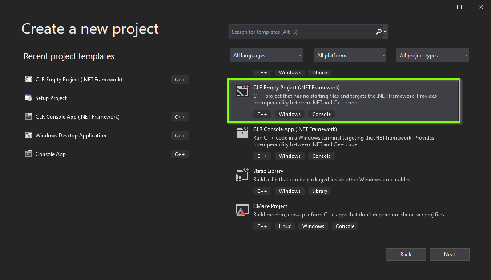
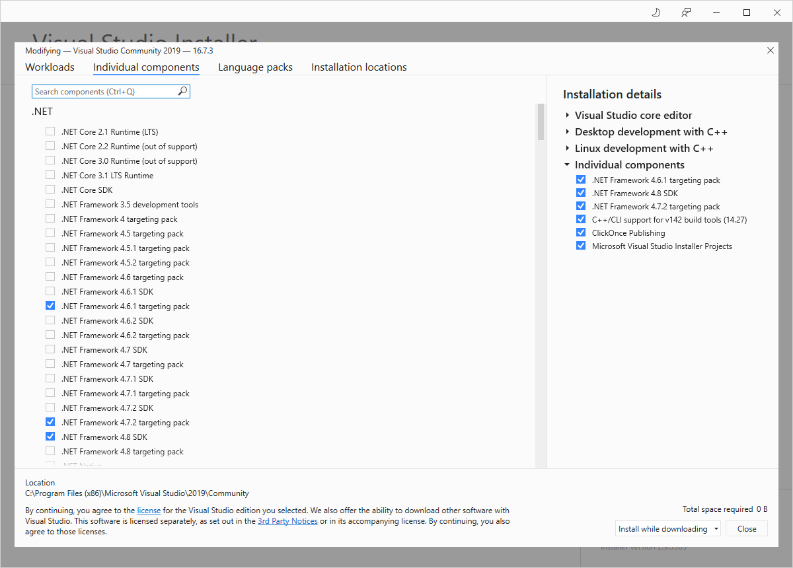
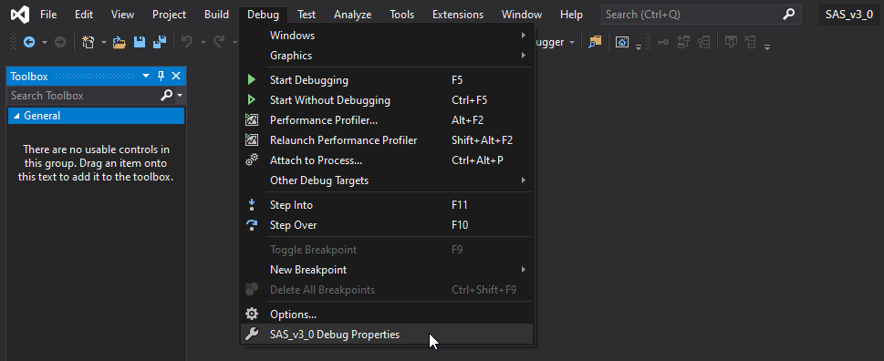
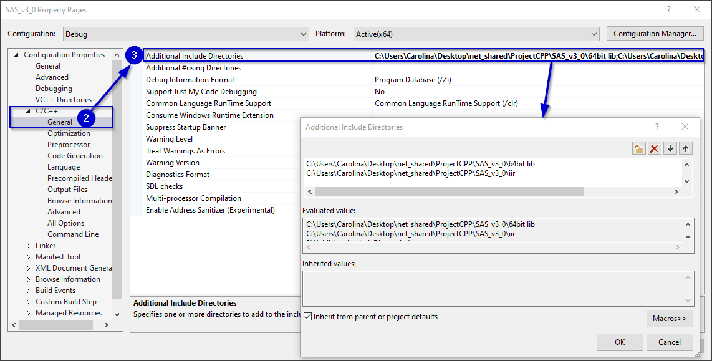
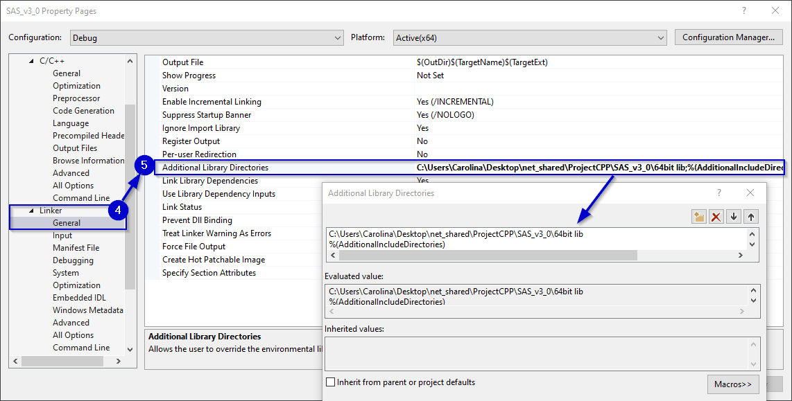
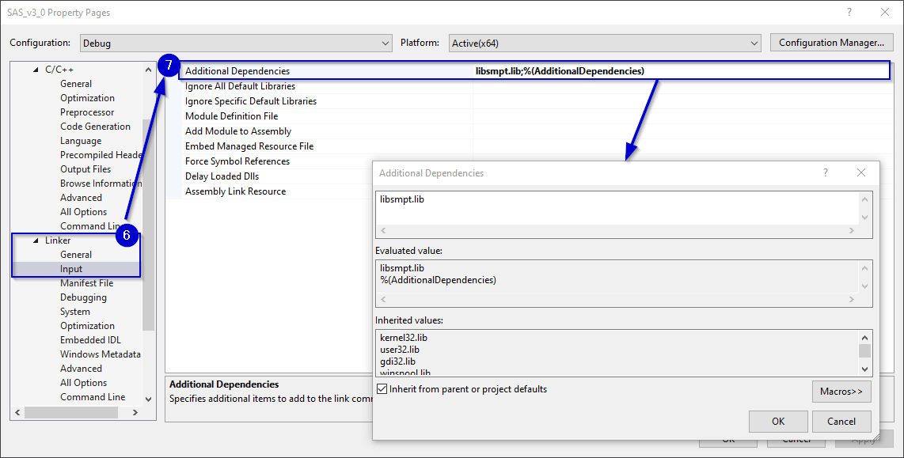
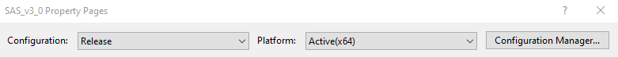
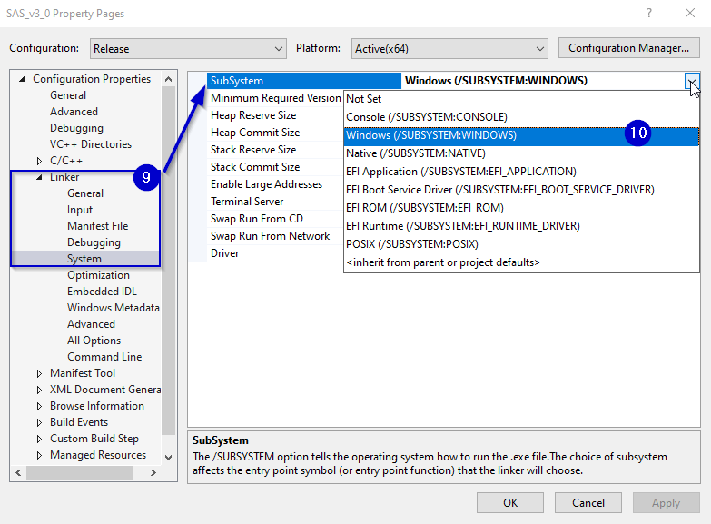
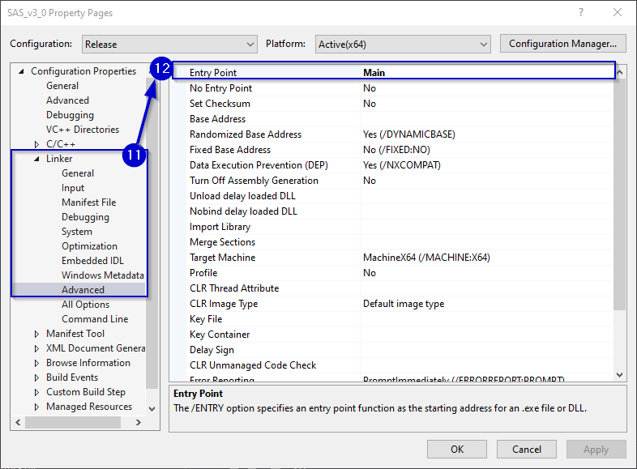

# SAS Program for ROBERT v3.0 #

### How to modify the program ###

##### Requesites #####

* Visual Studio 2019 or later.
* Complementary dependencies for CLR Project, such as Net Framework 3.72.

An easy way to check in Visual Studio if those dependencies have been installed, the following project template should be avaliable:



Otherwise, open the VS installer and check if the following components are installed:




##### Solution set up #####

Setting the SAS libraries the project in Visual Studio:

1. Clic on the top bar Debug > SAS_v3_0 Debug Propierties



2. On the C/C++ tab, select General.

3. On "Additional Include Directories" udpate or modify the location of the header files (devices and filters).



4. On the Linker tab, select General.

5. On "Additional Library Directories" update or modify the location of the devices library file.



6. Also on the Linker tab, select Input.

7. On "Additional Dependencies", include the devices library, called libsmpt.lib.



8. Repeat steps 1-7 for any other configuration that is going to be used: Release-x64, Debug-Win32, Release-Win32.
Remember to always check that the configuration matches with what the dependencies in C/C++ and Linker are set (32 lib folder with 32 bit configuration and viceversa).
In case of expecting to run the program in another computer, it is recommended to use the Release-x64 configuration.



In case of using another VS project with a GUI (using as template "CLR Empty project"):

9. On the Linker tab, select System.

10. On "Subsystem" -> Windows.



11. Also on the Linker tab, select Advanced.

12. On "Entry Point", set "Main" or any other function name that works as the main.



### How to run the program in another computer ###

On the other computer:

1. Install Microsoft Visual C++, or VC Redist.
[VC Redist download in Microsoft Support](https://support.microsoft.com/en-us/topic/the-latest-supported-visual-c-downloads-2647da03-1eea-4433-9aff-95f26a218cc0)

2. Install Microsoft Visual Remote Tools, or VS Remote Tools.
[VS Remote Tools download in Microsoft Support](https://visualstudio.microsoft.com/downloads/#remote-tools-for-visual-studio-2019)

3. Copy+paste the solution project.

4. Run the SAS_v3_0\x64\Release\SAS_v3_0.exe file.


### Generated files ###

A set of files are generated for every exercise, they are located in the SAS_v3_0\files folder. A brief description of each:

* NAME_filter_DATE_TIME.txt: EMG recording. It includes both raw and filtered data. Every row has the format:

```
raw_data, output_filter1, output_filter2, ... output_filterN
```

* NAME_th_DATE_TIME.txt: threshold set up and EMG activity. It contains information about the mean values used for the threshold, the final threshold value and the averga EMG afterwards. Its format per row may vary depending on if the data was discard, used for the threshold or for monitoring.

* NAME_log_DATE_TIME.txt: logs and events on the program, such as trigger, start/end repetition, etc.

* NAME_time_DATE_TIME.txt: main thread duty cycle. Every row has hte format:

```
duty_cycle, state;
```

To plot the data on Matlab, copy, export or include the files within MATLAB's workspace. The use the given functions in "Matlab scripts" as shown in Matlab\Example_script.m

